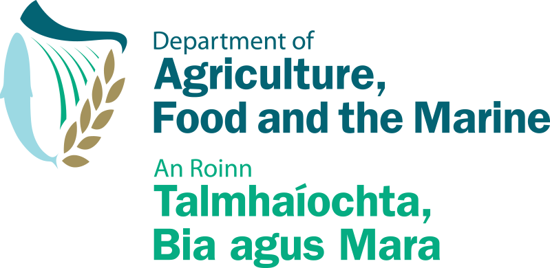

# Spatial analysis on the occurrence of Bird Flu in Ireland

 This analysis will investigate a dataset provided by Ireland's [Department of Agriculture, Food and the Marine](https://data.gov.ie/dataset/h5n1-wild-bird-species-identification) which contains the locations of bird species captured in Ireland from 1980-09-01 to 2020-01-27 and wild birds that are targeted for the H5N1 strain of avian flu.

According to the dataset's description: Avian influenza or **"Bird Flu"** is a contagious and often fatal viral disease of birds. Wild birds, particularly wild migratory water birds are considered to be the main reservoir of avian influenza viruses. There is a constant risk of avian influenza being introduced into Ireland from wild birds particularly from November onwards each year as this is when migratory birds arrive and congregate on wetlands, mixing with resident species.

To complement this risk analysis, a web scraping was performed to aggregate data from [BirdWatch Ireland](https://birdwatchireland.ie/) and spatial data about the administrative areas were provided by [Ordinance Survey Ireland](https://data-osi.opendata.arcgis.com/).

The notebook along with all data collection and preprocessing can be found [here](https://pessini.github.io/avian-flu-wild-birds-ireland/Datasets.html).

## Objective

The **aim** of this report is to map how this disease spread throughout the island and provide insights on possible spots and species that might need extra attention from the scientists who investigate this constant threat to resident birds.

## Questions

- What species have shown to be the most affected with Bird Flu?
- What are the most frequent locations where captured birds have been detected with Avian Flu?
- November is the month with the highest presence as mentioned? What are the months with the highest proportion of infected birds?
- The percentage of infected birds have been increasing during the years?
- What is the proportion of birds targeted with Avian Flu on each Council / County?
- Which areas present a statistically significant presence of Bird Flu?

[Notebook](https://pessini.github.io/avian-flu-wild-birds-ireland/)
