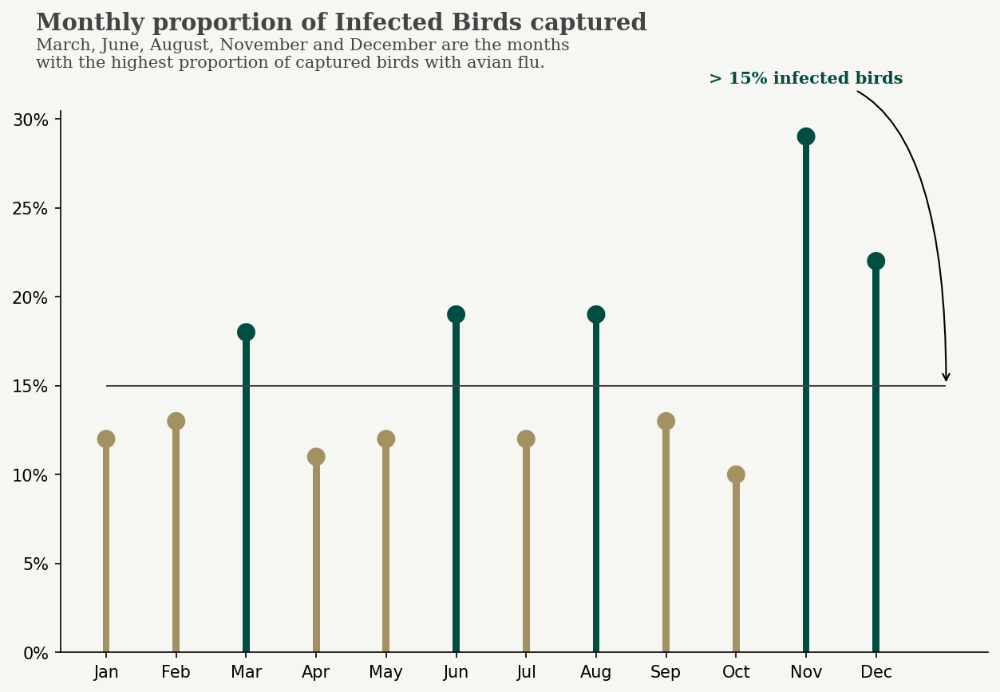

# Contents:

* [1. Introduction](#1)
* [2. Data Visualisation](#2)
    * [2.1 Proportion of captured birds with avian flu](#2.1)
    * [2.2 What species have shown to be the most affected by Bird Flu?](#2.2)
    * [2.3 What are the most frequent locations where captured birds have been targeted with Avian Flu?](#2.3)
    * [2.4 What are the months with the highest proportion of infected birds?](#2.4)
    * [2.5 Wild birds with avian flu have increased or have decreased in the past decade?](#2.5)
* [3. Geospatial data](#3)
    * [3.1 What is the proportion of birds targeted with Avian Flu on each Council / County?](#3.1)
    * [3.2 Which areas present a statistically significant presence of Bird Flu?](#3.2)
* [4. Conclusion](#4)

<a id="1"></a>
# 1- Introduction


 This analysis will investigate a dataset provided by Ireland's [Department of Agriculture, Food and the Marine](https://data.gov.ie/dataset/h5n1-wild-bird-species-identification) which contains the locations of bird species captured in Ireland from 1980-09-01 to 2020-01-27 and wild birds that are targeted for the H5N1 strain of avian flu.

According to the dataset's description: Avian influenza or **"Bird Flu"** is a contagious and often fatal viral disease of birds. Wild birds, particularly wild migratory water birds are considered to be the main reservoir of avian influenza viruses. There is a constant risk of avian influenza being introduced into Ireland from wild birds particularly from November onwards each year as this is when migratory birds arrive and congregate on wetlands, mixing with resident species.

To complement this risk analysis, a web scraping was performed to aggregate data from [BirdWatch Ireland](https://birdwatchireland.ie/) and spatial data about the administrative areas were provided by [Ordinance Survey Ireland](https://data-osi.opendata.arcgis.com/).

The notebook along with all data collection and preprocessing can be found [here](./datasets.html).

## Objective

The **aim** of this report is to map how this disease spread throughout the island and provide insights on possible spots and species that might need extra attention from the scientists who investigate this constant threat to resident birds.

## Questions

- What species have shown to be the most affected with Bird Flu?
- What are the most frequent locations where captured birds have been detected with Avian Flu?
- November is the month with the highest presence as mentioned? What are the months with the highest proportion of infected birds?
- The percentage of infected birds have increased during the years?
- What is the proportion of birds targeted with Avian Flu on each Council / County?
- Which areas present statistically significant incidence of Bird Flu?

<a id="2"></a>
# 2- Data Visualisation

### Colour Palette

```python
sns.palplot(['#004D44','#A39161','#F6F6F2','#FBFBFB']);
```


<a id="2.1"></a>
## Proportion of captured birds with avian flu


<a id="2.2"></a>
## What species have shown to be the most affected by Bird Flu?


**Birds Species with more than 200 Bird Flu cases:**
- Black-headed Gull: 332 https://birdwatchireland.ie/birds/black-headed-gull/
- Mute Swan: 273 https://birdwatchireland.ie/birds/mute-swan/
- Gray Heron: 259 https://birdwatchireland.ie/birds/grey-heron/
- Little Egret: 227 https://birdwatchireland.ie/birds/little-egret/

**All 4 species** with the highest number of bird flu occurrences **are resident species** which indicates that migratory birds carrying the virus and mixing with local birds play an important role in spreading the disease.

<a id="2.3"></a>
## What are the most frequent locations where captured birds have been targeted with Avian Flu?


<a id="2.4"></a>
## What are the months with the highest proportion of infected birds?



<a id="2.5"></a>
## Wild birds with avian flu have increased or have decreased in the past decade?


<a id="3"></a>
# 3- Geospatial data

<a id="3.1"></a>
## Choropleth map showing the proportion of captured birds targeted with Avian Flu in Ireland

<div class="choropleth-map">
    <object type="text/html" data="choropleth_map.html">choropleth-map</object>
    <!-- <iframe src="choropleth_map.html" height="600" width="100%" allowfullscreen="" frameborder="0"></iframe> -->
</div>

In **Roscommon/Ros Comáin** we see the highest proportion of infected birds and [Mute Swan](https://birdwatchireland.ie/birds/mute-swan/) represents almost half of the birds detected with Avian Flu.

Following the counties with the highest proportion is **Sligo/Sligeach** and [Whooper Swan](https://birdwatchireland.ie/birds/whooper-swan/) the species with the highest number. According to BirdWatch's website, Whooper Swan is a winter visitor to wetlands throughout Ireland from October to April. On the other hand, Mute Swan is an Irish resident.

In **Dublin/Baile Átha Cliath**, 3 species have the highest rate of infection and all of them are residents:

1. [Little Egret](https://birdwatchireland.ie/birds/little-egret/) - Resident along coasts and rivers throughout Ireland, but still scarce in the Midlands and north-west of the country. Little Egret was considered rare in Ireland until it first started breeding here in 1997. It has since expanded and now occurs in almost every coastal county, as well as at many inland sites.
2. [Gray Heron](https://birdwatchireland.ie/birds/grey-heron/) - Common resident at wetlands, estuaries and along rivers throughout Ireland.
3. [Black-headed Gull](https://birdwatchireland.ie/birds/black-headed-gull/) - Resident along all Irish coasts, with significant numbers arriving from the Continent in winter.

<a id="3.2"></a>
## Local indicators of spatial correlation - Hot Spot Analysis

A cluster can be random and, to gather more meaningful information, we can apply hot spot analysis which reveals areas that could unlikely be random.

**Hot Spot Analysis** - given a set of weighted features, identifies statistically significant hot spot and cold spots using Getis-Ord G* statistic

**Hypothesis** - null hypothesis
Complete Spatial Randomness - What are the chances of this pattern is a result of a random spatial process? How likely would it be to get this same pattern base on random chances?

> "...everything is related to everything else, but near things are more related than distant things." - The First Law of Geography, according to Waldo Tobler


### Hot Spots
- Sligo / Sligeach ( z = 1.353464 / p-value = 0.033 ) 
- Mayo / Maigh Eo ( z = 1.031976 / p-value = 0.020 )
- Longford / An Longfort ( z = 0.650739 / p-value = 0.028 )

### Cold Spots
- Laois / Laois ( z = -0.764141 / p-value = 0.018 )
- Carlow / Ceatharlach ( z = -0.675114 / p-value = 0.016 )
- Kilkenny / Cill Chainnigh ( z = -0.662391 / p-value = 0.035 )
- Louth / Lú ( z = -0.411557 / p-value = 0.019 )

**z = standardized G statistic in Getis & Ord (1992)**

**p-value < 0.05 - statistically significant**

<a id="4"></a>
# 4- Conclusion

The data shows that despite the concern about migrant wild birds carrying the "Bird Flu" virus being a potential pandemic threat, resident species have shown the highest number of infections which indicates there is a high risk of possible Bird Flu outbreaks in Ireland.

November and December are the months that need extra attention as stated by Ireland's Department of Agriculture, Food and the Marine but, even during the summer (June and August), the presence of infected birds was detected with high rates of infection among captured birds.

After reaching a peak of infection rate in 2015, the infection rate has presented stable between 14% and 18% from 2016 to 2019.

Although Sligo/Sligeach and Roscommon/Ros Comáin have presented the highest rate of infections, 3 counties were marked as hot spots, and especially Sligo and Mayo could be considered possible entering routes for the disease.